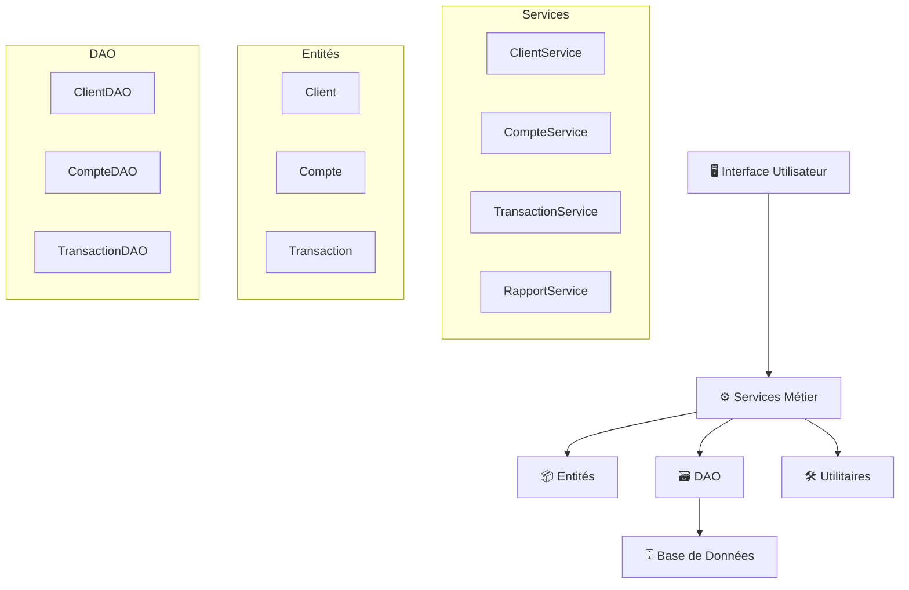
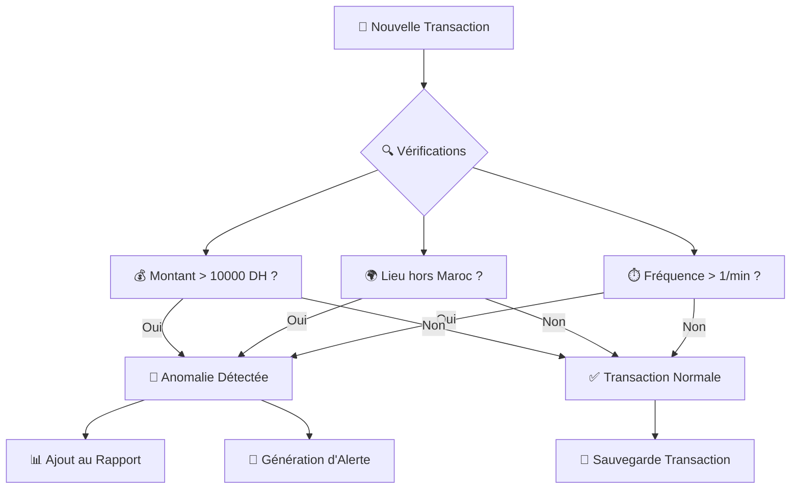

# 🏦 Système d'Analyse des Transactions Bancaires et Détection des Anomalies

[](https://www.oracle.com/java/)
[](https://www.mysql.com/)
[](LICENSE)
[]()

## 📋 Table des Matières

- [🎯 Contexte du Projet](#-contexte-du-projet)
- [🚀 Fonctionnalités](#-fonctionnalités)
- [🏗️ Architecture](#️-architecture)
- [📊 Structure du Projet](#-structure-du-projet)
- [🗄️ Base de Données](#️-base-de-données)
- [⚙️ Installation](#️-installation)
- [💻 Utilisation](#-utilisation)
- [🔧 Technologies](#-technologies)
- [📈 Diagrammes](#-diagrammes)
- [👥 Équipe](#-équipe)

---

## 🎯 Contexte du Projet

### 🏛️ À Propos de la Banque Al Baraka

La **Banque Al Baraka**, établissement régional en pleine croissance, fait face à des défis majeurs dans la gestion de ses flux financiers quotidiens. Avec des milliers de transactions effectuées chaque jour, le besoin d'un système automatisé de détection d'anomalies est devenu crucial.

### 🎯 Objectifs

L'application développée par **SoluBank Systems** permet aux gestionnaires et analystes financiers de :

- 📊 **Centraliser** l'ensemble des données clients, comptes et transactions
- 🔍 **Détecter automatiquement** les anomalies et transactions suspectes  
- 🚨 **Identifier** les comptes inactifs ou comportements inhabituels
- 📈 **Générer** des rapports fiables pour la prise de décision

---

## 🚀 Fonctionnalités

### 👥 Gestion des Clients
- ➕ Créer, modifier et supprimer des clients
- 🔍 Rechercher par ID ou nom
- 📋 Lister tous les clients avec statistiques

### 🏦 Gestion des Comptes
- 💳 Créer des comptes courants avec découvert autorisé
- 💰 Créer des comptes épargne avec taux d'intérêt
- ⚙️ Mettre à jour les paramètres de compte
- 📊 Consultation des soldes et statistiques

### 💸 Gestion des Transactions
- 📥 Enregistrer versements, retraits et virements
- 📈 Consulter l'historique complet
- 🔎 Filtrer par montant, type, date ou lieu
- 📊 Calculs statistiques avancés

### 🔍 Détection d'Anomalies
- 🚨 **Transactions suspectes** : montants élevés (> 10 000 DH)
- 🌍 **Lieux inhabituels** : transactions hors du Maroc
- ⏱️ **Fréquence excessive** : multiples transactions en peu de temps
- 💤 **Comptes inactifs** : détection automatique selon période définie

### 📊 Rapports et Analyses
- 🏆 Top 5 des clients par solde
- 📅 Rapports mensuels détaillés
- 🚨 Alertes automatiques (soldes bas, inactivité)
- 📈 Statistiques globales complètes

---

## 🏗️ Architecture

L'application suit une architecture en couches respectant les bonnes pratiques :

```
┌─────────────────────────────────────┐
│           🖥️ Couche UI              │
│        (Interface Utilisateur)      │
├─────────────────────────────────────┤
│         ⚙️ Couche Services          │
│        (Logique Métier)             │
├─────────────────────────────────────┤
│          📦 Couche Entity           │
│      (Modèles de Données)           │
├─────────────────────────────────────┤
│           🗃️ Couche DAO             │
│      (Accès aux Données)            │
├─────────────────────────────────────┤
│         🛠️ Couche Utilitaire        │
│    (Validation, Formatage, Dates)   │
└─────────────────────────────────────┘
```

### 🔧 Composants Principaux

#### 📦 Entités (Records & Sealed Classes)
- `Client` (record) : Informations client immutables
- `Compte` (sealed class) : Classe de base pour tous les comptes
- `CompteCourant` : Compte avec découvert autorisé
- `CompteEpargne` : Compte avec taux d'intérêt
- `Transaction` (record) : Enregistrement des opérations

#### ⚙️ Services Métier
- `ClientService` : Gestion complète des clients
- `CompteService` : Opérations sur les comptes
- `TransactionService` : Traitement des transactions
- `RapportService` : Génération d'analyses et rapports

---

## 📊 Structure du Projet

```
bank-anomaly-detector/
├── 📁 src/main/java/com/solubank/
│   ├── 🎯 Main.java
│   ├── 📁 dao/
│   │   ├── 👤 ClientDAO.java
│   │   ├── 🏦 CompteDAO.java
│   │   └── 💸 TransactionDAO.java
│   ├── 📁 entity/
│   │   ├── 👤 Client.java
│   │   ├── 🏦 Compte.java
│   │   ├── 💳 CompteCourant.java
│   │   ├── 💰 CompteEpargne.java
│   │   ├── 💸 Transaction.java
│   │   └── 🔄 TypeTransaction.java
│   ├── 📁 service/
│   │   ├── 👤 ClientService.java
│   │   ├── 🏦 CompteService.java
│   │   ├── 💸 TransactionService.java
│   │   └── 📊 RapportService.java
│   ├── 📁 ui/
│   │   └── 🖥️ MenuPrincipal.java
│   └── 📁 util/
│       ├── 🔗 DatabaseConnection.java
│       ├── 📅 DateUtil.java
│       └── ✅ ValidationUtil.java
├── 📁 src/main/resources/
│   └── 🗄️ database_init.sql
├── 📁 lib/
│   └── 🔌 mysql-connector-j-9.4.0.jar
├── 📁 docs/diagrammes/
├── 🔨 compile.bat
├── ▶️ run.bat
├── 📦 build-jar.bat
└── 📖 README.md
```

---

## 🗄️ Base de Données

### 📋 Schéma de la Base de Données

```sql
-- Table des clients
CREATE TABLE client (
    id BIGINT AUTO_INCREMENT PRIMARY KEY,
    nom VARCHAR(100) NOT NULL,
    email VARCHAR(150) NOT NULL UNIQUE,
    created_at TIMESTAMP DEFAULT CURRENT_TIMESTAMP,
    updated_at TIMESTAMP DEFAULT CURRENT_TIMESTAMP ON UPDATE CURRENT_TIMESTAMP
);

-- Table des comptes
CREATE TABLE compte (
    id BIGINT AUTO_INCREMENT PRIMARY KEY,
    numero VARCHAR(20) NOT NULL UNIQUE,
    solde DECIMAL(15,2) NOT NULL DEFAULT 0.00,
    id_client BIGINT NOT NULL,
    type_compte ENUM('COURANT', 'EPARGNE') NOT NULL,
    decouvert_autorise DECIMAL(15,2) NULL,
    taux_interet DECIMAL(5,2) NULL,
    created_at TIMESTAMP DEFAULT CURRENT_TIMESTAMP,
    updated_at TIMESTAMP DEFAULT CURRENT_TIMESTAMP ON UPDATE CURRENT_TIMESTAMP,
    FOREIGN KEY (id_client) REFERENCES client(id)
);

-- Table des transactions
CREATE TABLE transaction (
    id BIGINT AUTO_INCREMENT PRIMARY KEY,
    date TIMESTAMP NOT NULL DEFAULT CURRENT_TIMESTAMP,
    montant DECIMAL(15,2) NOT NULL,
    type ENUM('VERSEMENT', 'RETRAIT', 'VIREMENT') NOT NULL,
    lieu VARCHAR(200),
    id_compte BIGINT NOT NULL,
    created_at TIMESTAMP DEFAULT CURRENT_TIMESTAMP,
    FOREIGN KEY (id_compte) REFERENCES compte(id)
);
```

### 🔗 Relations
- 👤 **Client** ↔️ 🏦 **Compte** : Un client peut avoir plusieurs comptes (1:N)
- 🏦 **Compte** ↔️ 💸 **Transaction** : Un compte peut avoir plusieurs transactions (1:N)

---

## ⚙️ Installation

### 📋 Prérequis

- ☕ **Java 17+** : [Télécharger Java](https://www.oracle.com/java/technologies/downloads/)
- 🗄️ **MySQL 8.0+** : [Télécharger MySQL](https://dev.mysql.com/downloads/)
- 🔧 **Git** : [Télécharger Git](https://git-scm.com/)

### 🚀 Étapes d'Installation

1. **📥 Cloner le Repository**
   ```bash
   git clone https://github.com/votre-username/bank-anomaly-detector.git
   cd bank-anomaly-detector
   ```

2. **🗄️ Configurer la Base de Données**
   ```sql
   -- Créer la base de données
   CREATE DATABASE bank_anomaly_db;
   
   -- Importer le schéma
   mysql -u root -p bank_anomaly_db < src/main/resources/database_init.sql
   ```

3. **⚙️ Configuration de Connexion**
   
   Modifier les paramètres dans `DatabaseConnection.java` :
   ```java
   private static final String URL = "jdbc:mysql://localhost:3306/bank_anomaly_db";
   private static final String USERNAME = "your_username";
   private static final String PASSWORD = "your_password";
   ```

4. **🔨 Compilation**
   ```bash
   # Windows
   compile.bat
   
   # Ou manuellement
   javac -cp "lib/*" -d out src/main/java/com/solubank/**/*.java
   ```

5. **▶️ Exécution**
   ```bash
   # Windows
   run.bat
   
   # Ou manuellement  
   java -cp "out;lib/*" com.solubank.Main
   ```

---

## 💻 Utilisation

### 🖥️ Interface Principale

L'application propose un menu interactif avec les options suivantes :

```
📋 MENU PRINCIPAL
1. 👥 Gestion des clients
2. 🏦 Gestion des comptes  
3. 💸 Enregistrer une transaction
4. 📊 Consulter l'historique des transactions
5. 📈 Lancer une analyse
6. 🚨 Recevoir des alertes
0. 🚪 Quitter
```

### 📖 Guide d'Utilisation

#### 👥 Gestion des Clients
1. **Ajouter un client** : Saisir nom et email
2. **Rechercher** : Par ID ou nom partiel
3. **Modifier** : Mettre à jour les informations
4. **Consulter** : Voir solde total et nombre de comptes

#### 🏦 Gestion des Comptes
1. **Compte Courant** : Définir le découvert autorisé
2. **Compte Épargne** : Configurer le taux d'intérêt
3. **Consultation** : Voir détails et transactions

#### 💸 Transactions
1. **Versement** : Ajouter des fonds
2. **Retrait** : Retirer des fonds (avec vérification)
3. **Virement** : Transfert entre comptes

#### 📊 Analyses Avancées
- **Top 5 Clients** : Classement par solde
- **Rapport Mensuel** : Statistiques détaillées
- **Détection d'Anomalies** : Transactions suspectes
- **Comptes Inactifs** : Identification automatique

---

## 🔧 Technologies

### ☕ Technologies Principales
- **Java 17** : Langage principal avec features modernes
- **MySQL** : Base de données relationnelle
- **JDBC** : Connectivité base de données

### 🆕 Features Java Modernes Utilisées
- 📄 **Records** : Pour les entités immutables (Client, Transaction)
- 🔒 **Sealed Classes** : Pour la hiérarchie des comptes
- 🔄 **Switch Expressions** : Syntaxe moderne et concise
- 🌊 **Stream API** : Programmation fonctionnelle
- 📦 **Optional** : Gestion sûre des valeurs nulles
- 🔧 **var** : Inférence de type locale

### 🏛️ Patterns de Conception
- **DAO Pattern** : Séparation accès données/métier
- **Service Layer** : Encapsulation logique métier  
- **Singleton** : Pour la connexion base de données
- **Factory** : Création d'entités spécialisées

---

## 📈 Diagrammes

### 🏗️ Diagramme d'Architecture



### 🗂️ Diagramme de Classes


### 🔄 Diagramme de Flux - Détection d'Anomalies



---

## 🎯 Fonctionnalités de Sécurité

### 🔒 Détection d'Anomalies

| Type d'Anomalie | Critère | Action |
|------------------|---------|---------|
| 💰 **Montant Élevé** | > 10 000 DH | 🚨 Alerte automatique |
| 🌍 **Lieu Suspect** | Hors du Maroc | 📊 Rapport spécial |
| ⏱️ **Fréquence** | > 1 transaction/minute | 🔍 Vérification manuelle |
| 💤 **Inactivité** | Aucune transaction depuis N jours | 📧 Notification client |

### ✅ Validations Métier

- ✅ Vérification des fonds avant retrait
- ✅ Validation des formats email
- ✅ Contrôle des montants positifs
- ✅ Vérification de l'existence des comptes

---

## 📊 Exemples de Rapports

### 🏆 Top 5 Clients par Solde
```
=== TOP 5 DES CLIENTS PAR SOLDE TOTAL ===

1. Ahmed BENALI (ahmed.benali@email.com)
   Solde total: 125,450.00 DH
   Nombre de comptes: 3

2. Fatima ALAMI (f.alami@email.com)
   Solde total: 98,750.00 DH
   Nombre de comptes: 2
   
[...]
```

### 📅 Rapport Mensuel
```
=== RAPPORT MENSUEL - Octobre 2025 ===

VERSEMENT   : 145 transactions pour un volume de 2,450,000.00 DH
RETRAIT     : 89 transactions pour un volume de 890,000.00 DH
VIREMENT    : 34 transactions pour un volume de 340,000.00 DH

TOTAL: 268 transactions pour un volume de 3,680,000.00 DH
```

---

## 🐛 Dépannage

<div align="center">

### 🌟 Merci d'utiliser notre système ! 🌟

**Développé avec ❤️ par SoluBank Systems pour la Banque Al Baraka**

[🔝 Retour en haut](#-système-danalyse-des-transactions-bancaires-et-détection-des-anomalies)

</div>